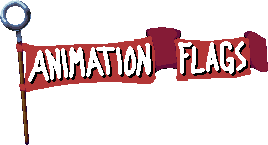

<p align="center" width="100%">
  
</p>

# Animation Flags

Version 1.4.1

Animation Flags manages multiple animations for a single sprite by flagging start and end points of the animations for GameMaker Studio 2.3.3+

## Installation

1. [Download the **.yymps** file](https://github.com/bfrymire/gml-animation-flags/releases/latest)
1. Import the **.yymps** file into your project from the top menu
    * Tools **>** Import Local Package

You can also drop the **.yymps** file downloaded from the [Releases](https://github.com/bfrymire/gml-animation-flags/releases/latest) tab directly onto your GMS IDE and follow the prompts.

## Setup

```js
// Set up AnimationManager
animator = new AnimationManager("Player", spr_pixel_platformer_player);

// Add AnimationFlags to manager
animator.add_flag(new AnimationFlag("idle", 1, 7, 0.15));
animator.add_flag(new AnimationFlag("run", 10, 17, 0.15));

// Set active flag
animator.set_flag("run");
```

[View a more detailed explanation Setup.](https://github.com/bfrymire/gml-animation-flags/wiki/Setup)

## Documentation

[Go to the Wiki](https://github.com/bfrymire/gml-animation-flags/wiki) to view the documentation.

## Limitations

Many of the limitations will be fixed in future updates:

- Does not tell you if the animation ends
- Need to manually edit `AnimationFlag` `start` and `stop` indexes if the sprite frames used in `AnimationManager` are changed
- `AnimationFlag.speed` does not take Frame Information from the [Image Editor](https://manual.yoyogames.com/The_Asset_Editors/Image_Editor.htm) or the Frame Speed from the [Sprite Editor](https://manual.yoyogames.com/The_Asset_Editors/Sprites.htm) into consideration

## Attributions

 - Pixel Platformer Player sprite in example created by [@Dead Revolver](https://deadrevolver.itch.io/pixel-prototype-player-sprites)
 - Color palette in example from [Dracula Theme](https://github.com/dracula/dracula-theme#color-palette)

## License

[MIT License](./LICENSE) &copy; Brent Frymire
